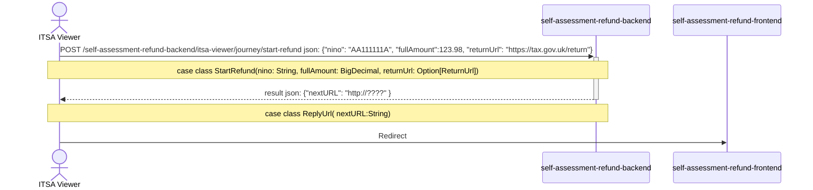

# self-assessment-refund-frontend

Component of the ITSA project to handle the refunds of self-assessments.

## Initialisation Sequence for repayment



[//]: # (![Sequance Diagram]&#40;sequance-diagram.png&#41;)

### Calling the endpoints

We are assuming this will be implemented redirected to this service something like this:

```java
ws.POST(backendBase+"/start-refund",StartValue("QQ123456C",1000.00, Some(ReturnUrl("https://tax.gov.uk/return"))))match{
        caes result if result.status==202=>Redirect(result.body.nextUrl)
        case _=> // error handler
        }
```

with auth session details being included in the header.

## Running tests

You can run the tests locally using sbt: `sbt clean test`

To run a specific spec, run `sbt 'testOnly *<SpecName>'`, e.g. `sbt 'testOnly *JourneyControllerSpec'`


## Run the service locally

```
sbt run -Dplay.http.router=testOnlyDoNotUseInAppConf.Routes

or

sm2 --start SELF_ASSESSMENT_REFUND_FRONTEND

for dependent services 

sm2 --start SELF_ASSESSMENT_REFUND

http://localhost:9171/self-assessment-refund/test-only/start-journey
```
and in development
```
https://www.development.tax.service.gov.uk/self-assessment-refund/test-only/start-journey
```

### Authority Wizard

After selecting a value from the "Ssarj: Start Self Assessment Refund Journey" page you may be redirected to
`Authority Wizard` to authenticate.

Use the following table to assign the required values:

| Affinity Group | Confidence Level | National Insurance Number (NINO)                     | Enrolments                                                                       |
|----------------|------------------|------------------------------------------------------|----------------------------------------------------------------------------------|
| Indvidual      | 50 (minimum)     | AB200111C - Required, must match value on Ssarj page | -                                                                                |
| Agent          | 50 (minimum)     | -                                                    | `HMRC-MTD-IT` enrolment with a key of `MTDITID` and a value of `FJWF01635669298` |

Recommended to see `tampermonkey/quickJourney.js` script for ease of use. Script also provides quick access to failure scenarios.

## License

This code is open source software licensed under the Apache 2.0 License.
