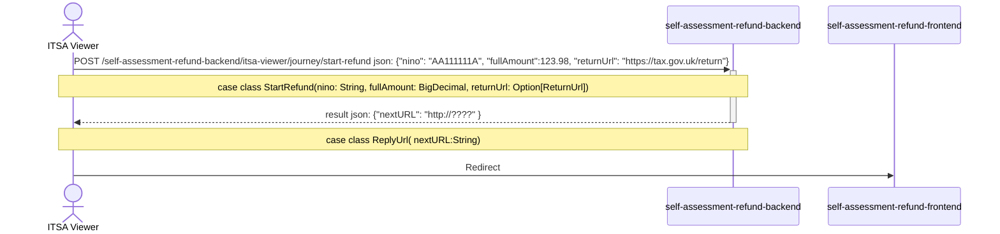

# self-assessment-refund-frontend

The frontend element of the self-assessment-refund service. Provides two journeys:
- a refund journey for a user to claim a refund
- a tracker journey for a user to track their refund claims

This repo migrated from private to public in January 2025. The repo history from before then is available at [self-assessment-refund-frontend-history](https://github.com/hmrc/self-assessment-refund-frontend-history). 

## Initialisation Sequence for Service



[//]: # (![Sequance Diagram]&#40;sequance-diagram.png&#41;)

### Calling the start endpoints

For services to connect with `self-assessment-refund-frontend`, they must call `self-assessment-refund-backend` to receive a redirect URL.

We would expect services to use something like this:

```java
ws.POST(backendBase + "/start-refund", StartValue("QQ123456C", 1000.00, Some(ReturnUrl("https://tax.gov.uk/return")))) 
        match {
            case result => if (result.status == 202) Redirect(result.body.nextUrl)
            case _ => // error handler
        }
```

with auth session details included in the header.

More details of these endpoints are available in the [self-assessment-refund-backend README](https://github.com/hmrc/self-assessment-refund-backend/blob/main/README.md). 

## Running tests

You can run the tests locally using sbt: `sbt clean test`

To run a specific spec, run `sbt 'testOnly *<SpecName>'`, e.g. `sbt 'testOnly *JourneyControllerSpec'`

## Run the service locally

```
sbt runTestOnly

or

sm2 --start SELF_ASSESSMENT_REFUND_FRONTEND

for dependent services 

sm2 --start SELF_ASSESSMENT_REFUND

http://localhost:9171/self-assessment-refund/test-only/start-journey
```
and in development
```
https://www.development.tax.service.gov.uk/self-assessment-refund/test-only/start-journey
```

### Authority Wizard

After selecting a value from the "Ssarj: Start Self Assessment Refund Journey" page you may be redirected to
`Authority Wizard` to authenticate.

Use the following table to assign the required values:

| Affinity Group | Confidence Level | National Insurance Number (NINO)                                          | Enrolments                                                                                                                                                                                    |
|----------------|------------------|---------------------------------------------------------------------------|-----------------------------------------------------------------------------------------------------------------------------------------------------------------------------------------------|
| Individual     | 250 (minimum)    | For Refund journey: AB200111C - Required, must match value on Ssarj page  | -                                                                                                                                                                                             |
| Individual     | 250 (minimum)    | For Tracker journey: AB111111C - Required, must match value on Ssarj page | -                                                                                                                                                                                             |
| Agent          | 50 (minimum)     | -                                                                         | `HMRC-MTD-IT` delegated enrolment with a key of `MTDITID`, a value of `FJWF01635669298`, and a delegated auth rule of `mtd-it-auth`                                                           |

Fo Agent additionally to above, the `HMRC-AS-AGENT` normal enrolment with a key of `AgentReferenceNumber`, any value i.e. `AARN1234567` can be given. Not all agents have this, so it is optional and used only in audits.

More details of test data are available in the [self-assessment-refund-stubs README](https://github.com/hmrc/self-assessment-refund-stubs/blob/main/README.md).

Recommended to see `tampermonkey/quickJourney.js` script for ease of use. Script also provides quick access to failure scenarios.

## License

This code is open source software licensed under the Apache 2.0 License.